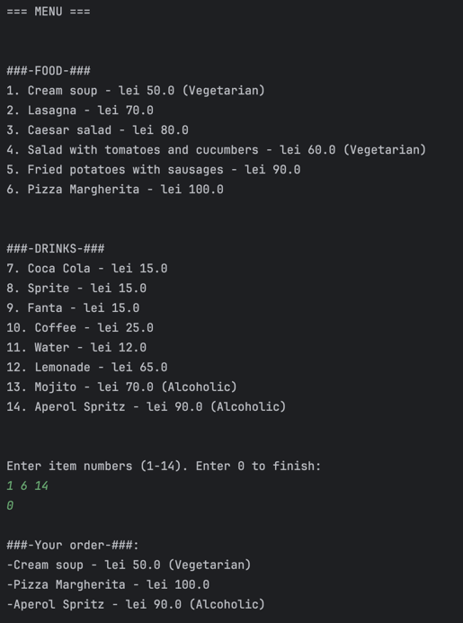
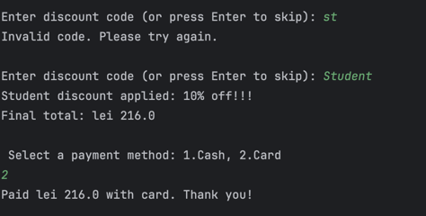

# TMPS LAB 1
Mutruc Victoria, FAF-232

## Theory
The SOLID principles are a set of five fundamental object-oriented design guidelines that help make software more modular, maintainable, and extensible.
Each letter stands for one principle:
* **S - Single Responsibility Principle**
    
    There should never be more than one reason for a class to change. In other words, every class should have only one responsibility.

* **O - Open Closed Principle**
  
    Software entities should be open for extension, but closed for modification.
* **L - Liskov substitution principle**
  
    Subclasses should be replaceable with their base classes without breaking the program.
  This ensures that a child class behaves consistently with its parent class’s interface and expected behavior.
*  **I - Interface Segregation Principle**

   Clients should not be forced to depend on interfaces they do not use.
   It encourages smaller, more specific interfaces instead of large, general ones.
*  **D - Dependency Inversion Principle**
   
    High-level modules should depend on abstractions, not on concrete implementations.

## Purpose of Laboratory Work
The purpose of this laboratory work was to design and implement a simple Java project that demonstrates object oriented design following **SOLID** principles.
The goal was to apply at least three of the SOLID principles in a practical example.

## Project Idea
The project is a **Restaurant Ordering System** that allows users to:
* View a menu containing both food and drink items.
* Add items to their order.
* Apply a discount code (example: STUDENT) for 10% off.
* Choose a payment method (cash or card).
* See the final total and order summary.

## Implemented SOLID Principles
### Single Responsibility Principle (SRP)
Each class in the project has a single, well-defined purpose:
* `MenuItem`, `Food`, and `Drink` -> store item details.
* `Order` -> manages the list of ordered items.
* `PriceCalculator` -> calculates the total price and applies discounts.
*  `PaymentMethod`, `CashPayment`, and `CardPayment` -> handle payment processing only.
* `RestaurantApp/Main` -> handles user interaction and program flow.

This separation ensures that modifying one feature does not affect unrelated parts of the system.

### Open/Closed Principle (OCP)
The system is designed to be easily extendable without changing existing code:
* New item types (ex: Dessert) can be added by extending the MenuItem class and creating a new child class.
* New discount codes (ex:VIP, STAFF) can be introduced by updating or extending PriceCalculator.
* New payment methods (ex: PayPalPayment, ApplePayment) can be added by implementing the PaymentMethod interface in a new class.

This design allows the system to grow without rewriting existing functionality.

### Liskov Substitution Principle (LSP)
Both `Food` and `Drink` classes inherit from the base class `MenuItem`.
They override the `getDescription()` method but can still be used anywhere a `MenuItem` object is expected:
```java
MenuItem soup = new Food("Cream soup", 50, true);
MenuItem cocaCola = new Drink("Coca Cola", 15, false);
```
The program treats both as generic menu items without breaking functionality.
This demonstrates correct substitution, therefore satisfying LSP.

### Interface Segregation & Dependency Inversion Principles
The Interface Segregation Principle (ISP) is applied through the `PaymentMethod` interface, which defines only one method - `pay`.
Each payment class (`CashPayment`, `CardPayment`) implements only what it needs, keeping the interface small and specific.
The Dependency Inversion Principle (DIP) is shown in how the main program depends on the PaymentMethod interface rather than concrete classes.
For example, `PaymentMethod payment = new CashPayment();` allows the system to support new payment types (like PayPalPayment) without changing existing code.
Together, these principles make the payment system flexible, easy to extend, and decoupled from implementation details.

## Results
In the following screenshots you can see that first a menu of food and drinks is diplayed. We then enter the desired items and enter 0 to end the order.
We are then given an overview of our order and we are asked for a discount code. I we wish to not enter a code - we just press Enter, else we can try to input a code till we get it right. If the code is right we will get a discount message. After, we are shown the final total amount and we are asked to choose a payment method. Finally, we see how much we paid and using which method.



## Conclusions
The Restaurant Ordering System successfully demonstrates key SOLID principles by keeping each class focused, extendable, and independent. Through clear separation of responsibilities, use of interfaces, and abstraction, the program became modular, maintainable, and easy to expand with new features such as discounts or payment methods.