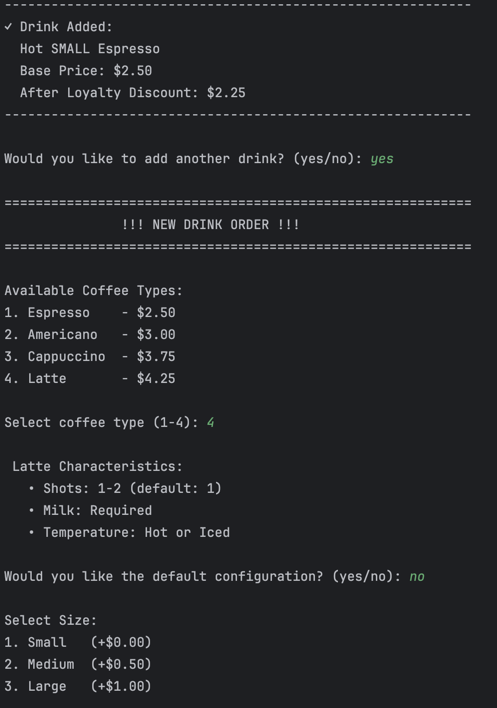

# Creational Design Patterns


## Author: Victoria Mutruc, Group FAF-232

----

## Objectives:

* Get familiar with the Creational DPs;
* Choose a specific domain;
* Implement at least 3 CDPs for the specific domain;


## Used Design Patterns:

* **Singleton** - Ensures that a class has only one instance and provides a global point of access to it.
* **Builder** - Separates the construction of a complex object from its representation, allowing it to be built step by step.
* **Factory Method** - Defines an interface for creating objects but allows subclasses to decide which class to instantiate.


## Implementation

* This project implements a realistic **coffee shop** ordering system where customers can order customized beverages through an interactive terminal interface. The system enforces authentic coffee preparation rules (ex: *Espresso* cannot have milk, *Cappuccino* requires milk, *Americano* defaults to 2 shots) while managing a loyalty program with membership verification and discounts.
* The three creational design patterns work together: Singleton manages global configuration and loyalty membership, Factory Method creates different coffee types based on user selection, and Builder constructs complex customized drinks with validation. The system demonstrates proper separation of concerns, with each pattern handling a specific aspect of object creation and configuration.

### Singleton
The `CoffeeShopConfig` class implements the **Singleton** pattern to ensure that only one configuration object exists throughout the entire program, managing global data such as tax rate, loyalty members, and shop settings.
It achieves this by making its constructor private and exposing a single synchronized access point via `getInstance()`, which creates the object only once.
This design guarantees that every class (for example, `Main` or `CoffeeBuilder`) uses the same consistent configuration data and prevents accidental re-initialization or duplication of state.

```java
private static CoffeeShopConfig instance;  // only one instance

private CoffeeShopConfig() {               // private constructor
    this.taxRate = 0.08;
    this.loyaltyDiscount = 0.10;
}

public static CoffeeShopConfig getInstance() {
    if (instance == null) {
        synchronized (CoffeeShopConfig.class) {
            if (instance == null) instance = new CoffeeShopConfig();
        }
    }
    return instance;
}
```

### Factory Method
The **Factory Method** pattern is implemented through the abstract class `CoffeeFactory`, which defines two factory methods: `createCoffee()` for instantiating coffee objects and `getDefaultBuilder()` for providing pre-configured builders. Each concrete factory subclass (such as `AmericanoFactory`, `EspressoFactory`, `LatteFactory`, `CappuccinoFactory`) overrides these methods to return their specific coffee type and corresponding default builder.This abstraction allows the client code to dynamically select coffee types and building strategies without directly instantiating concrete classes like new Americano() or new Latte(). 

```java
public abstract class CoffeeFactory {
    public abstract Coffee createCoffee();
    public abstract Builder getDefaultBuilder();

    public Coffee orderCoffee() {
        Coffee coffee = createCoffee();
        System.out.println("Preparing: " + coffee.getName());
        return coffee;
    }
}
```

```java
public class EspressoFactory extends CoffeeFactory {
    @Override
    public Coffee createCoffee() {
        return new Espresso();
    }
    @Override
    public Builder getDefaultBuilder() {
        return new DefaultEspressoBuilder();
    }
}
```
### Builder
The `Builder` pattern is implemented through a builder interface and two distinct builder strategies: default builders and a customizable builder. This design allows users to either quickly select pre-configured coffee options or customize their drink step-by-step.The CoffeeBuilderInterface defines the contract that all builders must follow, ensuring consistency across different builder implementations. Each coffee type has a corresponding DefaultBuilder (e.g., `DefaultLatteBuilder`, `DefaultEspressoBuilder`) that provides a sensible, ready-to-use configuration matching traditional coffee shop standards. 
```java
package domain.builder;

import domain.models.Coffee;

public interface Builder{
    Coffee build();
}
```
For users who want personalization, the `CoffeeBuilder` class offers chainable methods (`withSize()`, `withMilkType()`, `addExtra()`, `makeIced()`, `withShots()`) that allow flexible configuration while automatically validating constraints such as milk requirements, shot limits, and temperature options based on the coffee type.This approach separates the construction logic from the product representation, keeping client code clean and providing both convenience (default configurations) and flexibility (full customization). The pattern validates all configurations before building, ensuring only valid coffee objects are created.
```java
 @Override
    public Coffee build() {
        coffee.setSize(size);

        // Ensure milk requirement is met
        if (coffee.requiresMilk() && milkType == null) {
            System.out.println("!!! " + coffee.getName() + " requires milk. Using default Whole Milk.");
            milkType = MilkType.WHOLE;
        }

        coffee.setMilkType(milkType);
        coffee.setExtras(extras);
        coffee.setShots(shots);
        coffee.setIced(iced);

        if (!coffee.isValidConfiguration()) {
            throw new IllegalStateException("Invalid coffee configuration");
        }

        coffee.calculatePrice();
        return coffee;
    }
```
## Results
In the first image we are shown a welcome message, the tax rate and we are asked if we are a member of the loyalty program. If no, we are asked if we want to join. I answered yes, so I was asked for my number and then got a success message. The coffee menu was then displayed and I was asked to select a coffee. I selected an Espresso and selected that I want its default version. 

 

The program then asks me if I want to add another drink and I choose to ass a customizable Latte.




I then get a summary of this drink with its base price and price after loyalty program.


Finally, I got the receipt:


## Conclusions
In conclusion, this project demonstrates how combining Singleton, Factory Method, and Builder patterns results in a flexible, organized, and maintainable system for object creation.
Each pattern serves a distinct purpose: the Singleton ensures consistent global configuration, the Factory Method manages polymorphic object creation, and the Builder enables clean, step-by-step customization, working together to produce scalable, reusable, and easily extendable code.