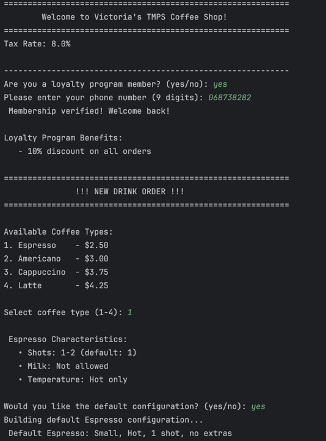
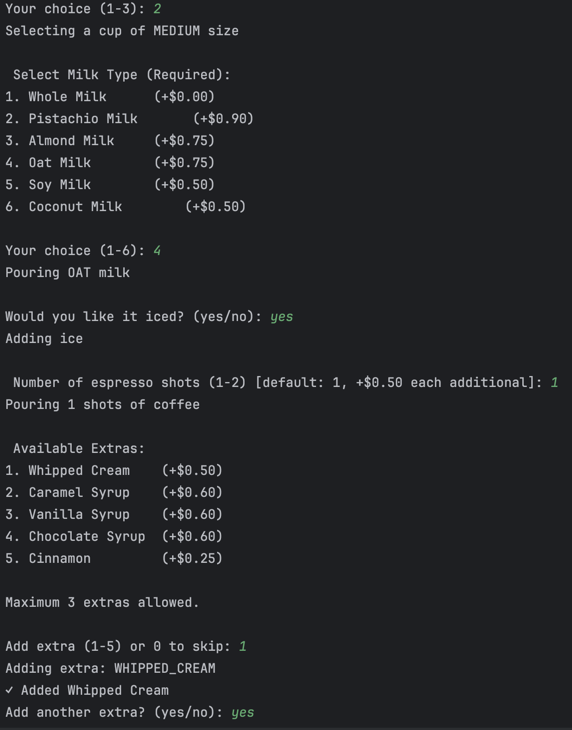

# Creational Design Patterns


## Author: Victoria Mutruc, Group FAF-232

----

## Objectives:

* Get familiar with the Creational DPs;
* Choose a specific domain;
* Implement at least 3 CDPs for the specific domain;


## Used Design Patterns:

* **Singleton** - Ensures that a class has only one instance and provides a global point of access to it.
* **Builder** - Separates the construction of a complex object from its representation, allowing it to be built step by step.
* **Factory Method** - Defines an interface for creating objects but allows subclasses to decide which class to instantiate.


## Implementation

* This project implements a realistic **coffee shop** ordering system where customers can order customized beverages through an interactive terminal interface. The system enforces authentic coffee preparation rules (ex: *Espresso* cannot have milk, *Cappuccino* requires milk, *Americano* defaults to 2 shots) while managing a loyalty program with membership verification and discounts.
* The three creational design patterns work together: Singleton manages global configuration and loyalty membership, Factory Method creates different coffee types based on user selection, and Builder constructs complex customized drinks with validation. The system demonstrates proper separation of concerns, with each pattern handling a specific aspect of object creation and configuration.

### Singleton
The `CoffeeShopConfig` class implements the **Singleton** pattern to ensure that only one configuration object exists throughout the entire program, managing global data such as tax rate, loyalty members, and shop settings.
It achieves this by making its constructor private and exposing a single synchronized access point via `getInstance()`, which creates the object only once.
This design guarantees that every class (for example, `Main` or `CoffeeBuilder`) uses the same consistent configuration data and prevents accidental re-initialization or duplication of state.

```java
private static CoffeeShopConfig instance;  // only one instance

private CoffeeShopConfig() {               // private constructor
    this.taxRate = 0.08;
    this.loyaltyDiscount = 0.10;
}

public static CoffeeShopConfig getInstance() {
    if (instance == null) {
        synchronized (CoffeeShopConfig.class) {
            if (instance == null) instance = new CoffeeShopConfig();
        }
    }
    return instance;
}
```

### Factory Method
The **Factory Method** pattern is realized through the abstract class `CoffeeFactory`, which defines the `createCoffee()` method that each concrete subclass (like `AmericanoFactory`, `EspressoFactory`) overrides to instantiate its respective coffee type.
In the main application, this abstraction lets the user choose a drink type dynamically without directly calling `new Americano()` or `new Latte()`, keeping the client code decoupled from the concrete classes.

```java
// Abstract creator
public abstract class CoffeeFactory {
    public abstract Coffee createCoffee();
}

// Concrete factory
public class AmericanoFactory extends CoffeeFactory {
    @Override
    public Coffee createCoffee() {
        return new Americano();
    }
}

// In Main.java
CoffeeFactory factory = selectCoffeeType();
Coffee baseCoffee = factory.createCoffee();

```

By delegating object creation to factory subclasses, your code becomes easier to extend, new coffee types can be added by simply creating new factory classes without changing the existing logic.

### Builder
The **Builder** pattern is implemented in the `CoffeeBuilder` class to handle the complex step-by-step construction of a customized coffee order.
It allows chaining configuration methods (`withSize()`, `withMilkType()`, `addExtra()`, `makeIced()`) before calling `build()` to assemble the final `Coffee` object with the selected options.
```java
// Use Builder Pattern to customize
CoffeeBuilder builder = new CoffeeBuilder(baseCoffee);

// Customize size
Size size = selectSize();
        builder.withSize(size);

// Customize milk type (only if allowed)
        if (baseCoffee.allowsMilk()) {
MilkType milkType = selectMilkType(baseCoffee.requiresMilk());
            if (milkType != null) {
        builder.withMilkType(milkType);
            }
                    } else {
                    System.out.println("\n " + baseCoffee.getName() + " does not include milk.");
        }

        // Select if iced (only if allowed)
        if (baseCoffee.canBeIced()) {
        System.out.print("\nWould you like it iced? (yes/no): ");
String icedResponse = scanner.nextLine().trim().toLowerCase();
            if (icedResponse.equals("yes") || icedResponse.equals("y")) {
        builder.makeIced();
            }
                    } else {
                    System.out.println("\n " + baseCoffee.getName() + " is served hot only.");
        }

// Select number of shots (within allowed range)
int shots = selectShots(baseCoffee);
        builder.withShots(shots);

// Add extras
addExtras(builder);

        return builder.build();
```
This approach separates the logic of how a coffee is built from how it is represented, keeping the code in `Main` clean and letting users mix options flexibly while validating combinations like milk requirements or shot limits.
## Results
In the first image we are shown a welcome message, the tax rate and we are asked if we are a member of the loyalty program. If no, we are asked if we want to join. I answered yes, so I was asked for my number and then got a success message. The coffee menu was then displayed and I was asked to select a coffee. I selected a Latte and its characteristics appeared. 



The program then asks to select a size for the cup, milk type, whether I want it iced or hot, nr. of espresso shots and whether I want any extras. We are then displayed a base price and price with loyalty discount.


I can also add more drinks if I wish and I added an americano.




Finally, I got the receipt:


## Conclusions
In conclusion, this project demonstrates how combining Singleton, Factory Method, and Builder patterns results in a flexible, organized, and maintainable system for object creation.
Each pattern serves a distinct purpose: the Singleton ensures consistent global configuration, the Factory Method manages polymorphic object creation, and the Builder enables clean, step-by-step customization, working together to produce scalable, reusable, and easily extendable code.