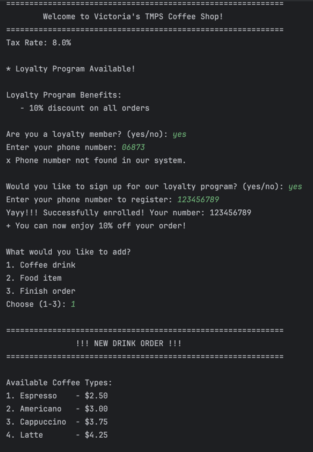
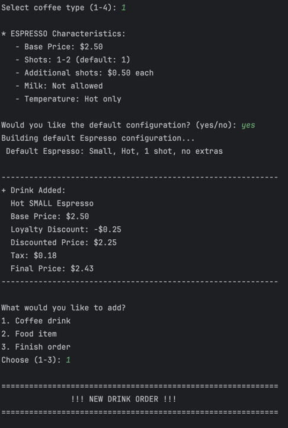
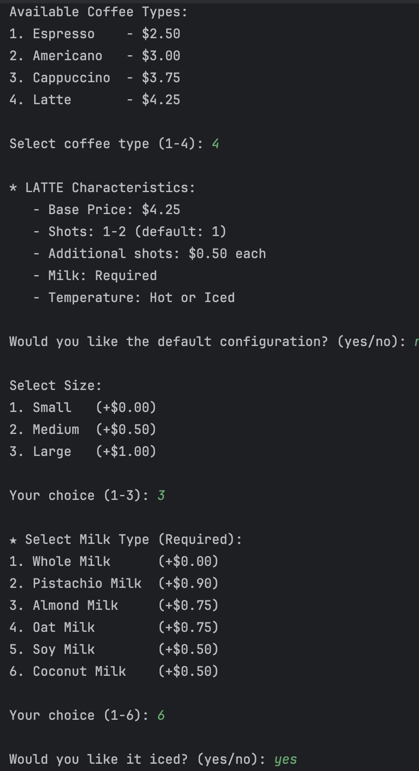
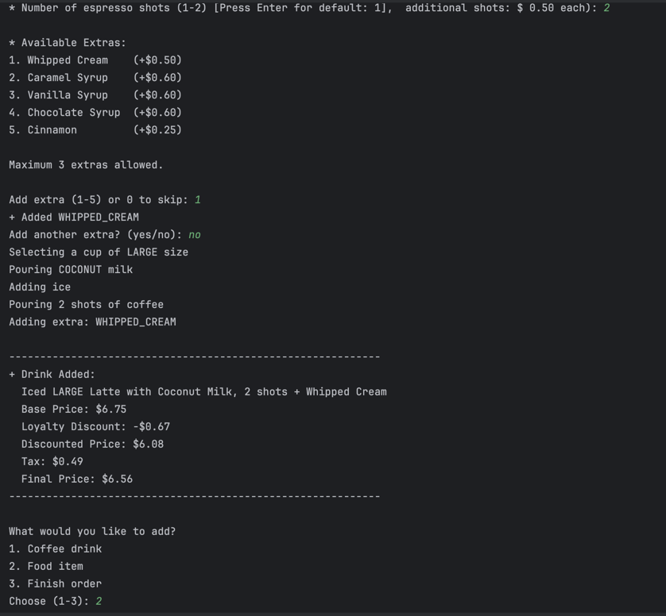
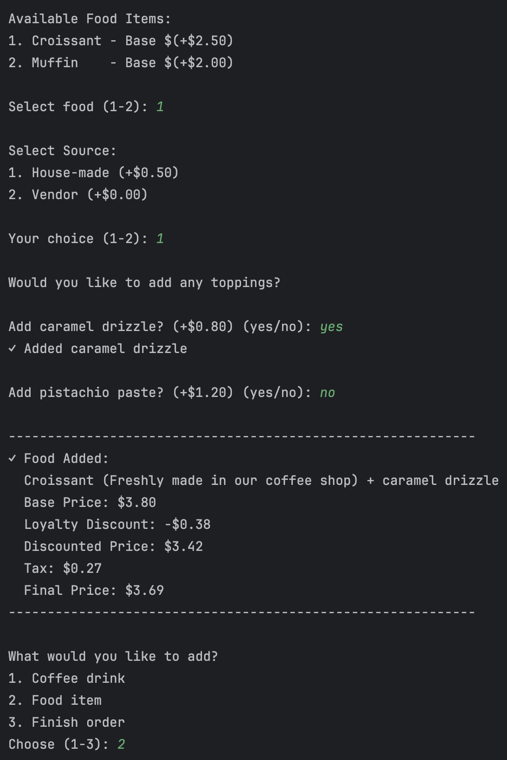
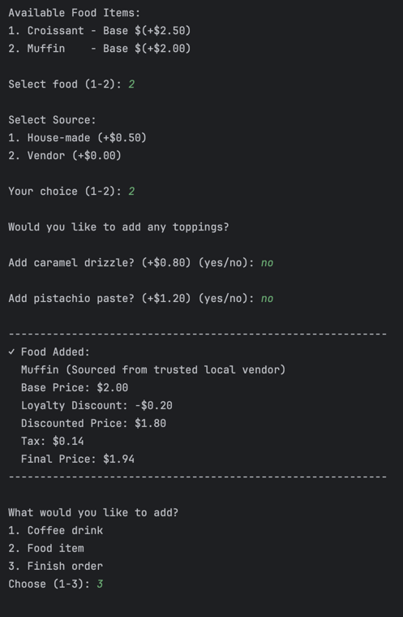
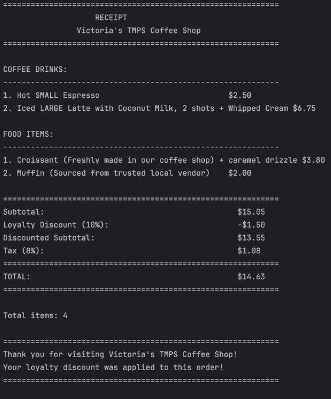

# Structural Design Patterns


## Author: Victoria Mutruc, Group FAF-232

----

## Objectives:

1. Study and understand the Structural Design Patterns.
2. As a continuation of the previous laboratory work, think about the functionalities that your system will need to provide to the user.
3. Implement some additional functionalities using structural design patterns.


## Used Design Patterns:
In software engineering, the Structural Design Patterns are concerned with how classes and objects are composed to form larger structures. Structural class patterns use inheritance to create a hierarchy of classes/abstractions, but the structural object patterns use composition which is generally a more flexible alternative to inheritance.

* **Facade** - Provides a simplified, unified interface to a complex subsystem, making it easier for clients to interact with multiple components without needing to understand their internal complexities.
* **Bridge** - Separates an abstraction from its implementation so that the two can vary independently, allowing different combinations of abstractions and implementations without creating a rigid class hierarchy.
* **Decorator** - Dynamically adds responsibilities to objects by wrapping them in decorator objects, enabling flexible extension of functionality without modifying the original class structure.


## Implementation

This laboratory work extends the previous coffee shop ordering system by adding food items (croissants and muffins) with topping decorators and implementing three structural design patterns: Facade, Bridge, and Decorator. The system now allows customers to order both beverages and food items through an enhanced interactive terminal interface managed by the OrderFacade.

### Facade
The `OrderFacade` class implements the **Facade** pattern by providing a simplified, unified interface to the complex coffee and food ordering subsystem. It hides the complexity of creating coffee objects, food sources, applying decorators, and managing the ordering process from the client code (`UserInterface`).

The client simply calls orderFacade.calculateFinalPrice(price) and receives the result without direct dependency on the configuration subsystem. The facade acts as an intermediary, decoupling the UI from the singleton pattern implementation and tax calculation logic.
```java
public double[] calculateFinalPrice(double price) {
    return config.calculateFinalPrice(price);
}
```

### Bridge

The **Bridge** pattern separates the food item abstraction (`Food` interface implemented by `Croissant` and `Muffin`) from its sourcing implementation (`FoodSource` interface implemented by `HouseMadeSource` and `VendorSource`). This allows food types and sourcing methods to vary independently without creating a rigid class hierarchy.

```java
public class Croissant implements Food {
    private final FoodSource source;

    public Croissant(FoodSource source) {
        this.source = source;
    }

    @Override
    public String getDescription() {
        return "Croissant (" + source.getSourceName() + ")";
    }

    @Override
    public double getFinalPrice() {
        return getBasePrice() + source.getAdditionalCost();
    }
}

```

The bridge connection is established through aggregation, each food item holds a reference to a `FoodSource` object. This design enables flexible combinations: any food item can work with any source (house-made or vendor), and new food types or sources can be added independently without modifying existing code.

### Decorator
The **Decorator** pattern dynamically adds responsibilities to food objects by wrapping them in decorator objects. The `FoodDecorator` abstract class implements the `Food` interface and maintains a reference to a wrapped `Food` object.

Concrete decorators like CaramelSauceDecorator and PistachioPasteDecorator extend FoodDecorator to add specific toppings, modifying the description and price without changing the base food classes.

```java
public class CaramelSauceDecorator extends FoodDecorator {
    public static final double CARAMEL_PRICE = 0.80;

    public CaramelSauceDecorator(Food food) {
        super(food);
    }

    @Override
    public String getDescription() {
        return wrappedFood.getDescription() + " + Caramel Drizzle";
    }

    @Override
    public double getFinalPrice() {
        return wrappedFood.getFinalPrice() + CARAMEL_PRICE;
    }

    @Override
    public double getBasePrice() {
        return CARAMEL_PRICE;
    }
}

```
## Results
The application welcomes the user with the shop name and displays the current tax rate (8.0%). The loyalty program is presented, offering a 10% discount on all orders. When the user confirms they want to join, they enter their phone number (123456789), which is successfully registered in the system.



After enrollment, the coffee menu is displayed with four types and their base prices. The user selects *Espresso* and chooses the default configuration. The system shows the Espresso's characteristics (Small, Hot, 1 shot, no extras) and calculates the final price with loyalty discount applied and tax, resulting in 2.43 total.



The user adds a custom *Latte* to the order. The system displays Latte characteristics (base price 4.25, requires milk, can be hot or iced). The user selects Large size (+ 1.00), Coconut Milk (+ 0.50), makes it iced, and requests 2 shots (1 additional shot for +0.50).



The user adds Whipped Cream (+ 0.50) as an extra. The system provides a detailed summary: "Iced LARGE Latte with Coconut Milk, 2 shots + Whipped Cream" with base price 6.75, loyalty discount - 0.67, discounted price 6.08, tax 0.49, and final price - 6.56.



The user adds a *Croissant*, choosing the House-made source (+ 0.50). When prompted for toppings, they select caramel drizzle (+ 0.80), demonstrating the Decorator pattern. The food item shows as "Croissant (Freshly made in our coffee shop) + caramel drizzle" with base price 3.80, loyalty discount - 0.38, resulting in $3.69 final price with tax.



The user adds a *Muffin*, selecting Vendor source (+ 0.00), demonstrating the **Bridge pattern**'s flexibility to combine different food types with different sources. They decline both topping options. The system displays "Muffin (Sourced from trusted local vendor)" with base price 2.00, loyalty discount - 0.20, and final price 1.94 with tax.



The receipt displays all ordered items organized by category:
 * Coffee Drinks: Hot SMALL Espresso (2.50), Iced LARGE Latte with Coconut Milk, 2 shots + Whipped Cream (6.75)
 * Food Items: Croissant (Freshly made in our coffee shop) + caramel drizzle (3.80), Muffin (Sourced from trusted local vendor) (2.00)



## Conclusions
This laboratory work successfully added food ordering capabilities to the coffee shop system by implementing three structural design patterns. The **Facade** pattern simplified complex operations by providing a single `OrderFacade` interface that handles coffee creation, food ordering, pricing, and loyalty calculations, the **Bridge** pattern allowed food items and their sources to change independently, and the **Decorator** pattern enabled flexible topping additions without creating many subclasses. These patterns work together with the previous creational patterns to create a maintainable system that can easily grow with new features.