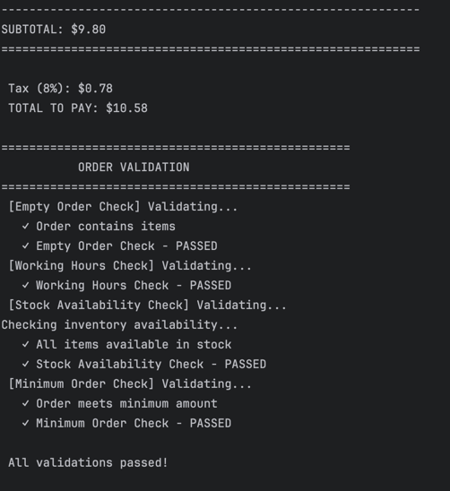
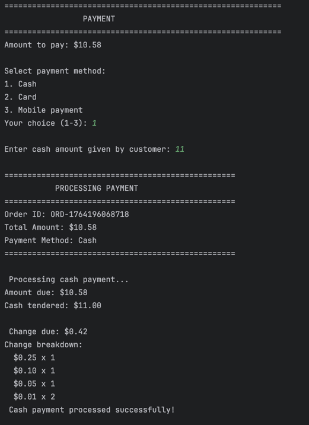
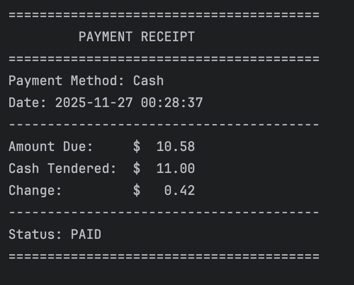
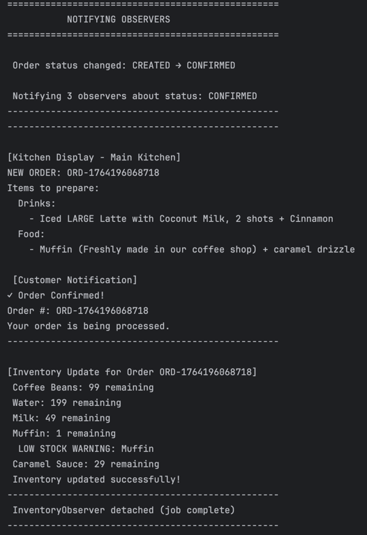
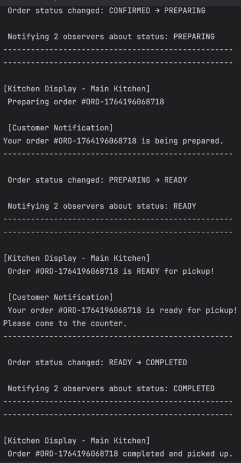
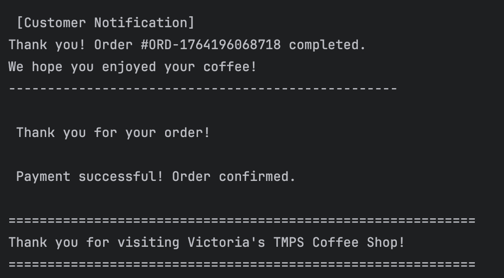

# Behavioral Design Patterns

## Author: Victoria Mutruc, Group FAF-232

----

## Objectives:

1. Study and understand the Behavioral Design Patterns.
2. As a continuation of the previous laboratory work, think about the functionalities that your system will need to provide to the user.
3. Implement some additional functionalities using 3 behavioral design patterns.

## Used Design Patterns:

Behavioral Design Patterns are concerned with algorithms and the assignment of responsibilities between objects. These patterns characterize complex control flow that's difficult to follow at run-time and shift focus away from the flow of control to let you concentrate on the way objects are interconnected.

* **Chain of Responsibility** - Passes a request along a chain of handlers, where each handler decides either to process the request or pass it to the next handler in the chain, decoupling the sender from the receiver.
* **Strategy** - Defines a family of algorithms, encapsulates each one, and makes them interchangeable, allowing the algorithm to vary independently from clients that use it.
* **Observer** - Defines a one-to-many dependency between objects so that when one object changes state, all its dependents are notified and updated automatically.

## Implementation

This laboratory work extends the coffee shop ordering system by implementing order validation, payment processing, and order status notifications using three behavioral design patterns. The system now validates orders before payment, supports multiple payment methods, and notifies relevant parties about order status changes.

### Chain of Responsibility

The **Chain of Responsibility** pattern implements a validation pipeline where each handler validates a specific aspect of the order before passing it to the next handler. The chain is established in `OrderFacade` and executed before payment processing.

```java
private void setupValidationChain() {
    OrderValidationHandler emptyOrderHandler = new EmptyOrderHandler();
    OrderValidationHandler workingHoursHandler = new WorkingHoursHandler();
    OrderValidationHandler stockHandler = new StockAvailabilityHandler();
    OrderValidationHandler minimumOrderHandler = new MinimumOrderHandler();

    emptyOrderHandler.setNext(workingHoursHandler);
    workingHoursHandler.setNext(stockHandler);
    stockHandler.setNext(minimumOrderHandler);

    validationChain = emptyOrderHandler;
}
```

The validation chain consists of four handlers:

1. **EmptyOrderHandler** - Ensures the order contains at least one item
2. **WorkingHoursHandler** - Checks if the shop is currently open 
3. **StockAvailabilityHandler** - Verifies all items are available in inventory
4. **MinimumOrderHandler** - Validates the order meets the minimum amount ($3.00)

Each handler implements the `OrderValidationHandler` abstract class:

```java
public abstract class OrderValidationHandler {
    protected OrderValidationHandler nextHandler;
    private final String handlerName;

    public void setNext(OrderValidationHandler next) {
        this.nextHandler = next;
    }

    public boolean validate(Order order) {
        if (!doValidation(order)) {
            return false;
        }
        return nextHandler == null || nextHandler.validate(order);
    }

    protected abstract boolean doValidation(Order order);
}
```

If any handler fails, the validation stops immediately and the order is rejected. Only after all validations pass can the payment be processed.

### Strategy

The **Strategy** pattern encapsulates different payment methods (cash, card, mobile) into interchangeable strategy objects. Each payment strategy implements the `PaymentStrategy` interface:

```java
public interface PaymentStrategy {
    boolean processPayment(double amount);
    String getPaymentReceipt(double amount);
    String getPaymentMethodName();
}
```

Three concrete strategies are implemented:

**CashPaymentStrategy** - Validates cash tendered is sufficient and calculates change:

**CardPaymentStrategy** - Validates card details (number, CVV, expiry):

**MobilePaymentStrategy** - Processes mobile payments (Apple Pay, Google Pay, etc.):


### Observer

The **Observer** pattern notifies interested parties (observers) when an order's status changes. The `OrderSubject` maintains a list of observers and notifies them of status updates:

```java
public class OrderSubject {
    private List<OrderStatusObserver> observers;
    private String status;

    public void attach(OrderStatusObserver observer) {
        observers.add(observer);
    }

    public void setStatus(String status, Order order) {
        this.status = status;
        System.out.println("Order status changed: " + status);
        notifyObservers(order);
    }

    private void notifyObservers(Order order) {
        List<OrderStatusObserver> observersCopy = new ArrayList<>(observers);
        for (OrderStatusObserver observer : observersCopy) {
            observer.update(status, order);
        }
    }
}
```

All observers implement the `OrderStatusObserver` interface:

```java
public interface OrderStatusObserver {
    void update(String status, Order order);
}
```

Three observers are implemented:

**KitchenDisplayObserver** - Displays order information on the kitchen screen:

```java
public class KitchenDisplayObserver implements OrderStatusObserver {
    @Override
    public void update(String status, Order order) {
        switch (status) {
            case "CONFIRMED":
                System.out.println(" NEW ORDER RECEIVED: #" + order.getOrderId());
                displayOrderDetails(order);
                break;
            case "PREPARING":
                System.out.println(" Preparing order #" + order.getOrderId());
                break;
            case "READY":
                System.out.println(" Order READY for pickup!");
                break;
        }
    }
}
```

**CustomerNotificationObserver** - Sends notifications to the customer:

```java
public class CustomerNotificationObserver implements OrderStatusObserver {
    @Override
    public void update(String status, Order order) {
        switch (status) {
            case "CONFIRMED":
                notifyOrderConfirmed(order);
                break;
            case "PREPARING":
                notifyOrderPreparing(order);
                break;
            case "READY":
                notifyOrderReady(order);
                break;
            case "COMPLETED":
                notifyOrderCompleted(order);
                break;
        }
    }
}
```

**InventoryObserver** - Updates stock levels and detaches itself after the CONFIRMED status:

```java
public class InventoryObserver implements OrderStatusObserver {
    private OrderSubject subject;

    @Override
    public void update(String status, Order order) {
        if (status.equals("CONFIRMED")) {
            System.out.println("-".repeat(50));
            updateInventory(order);
            System.out.println("-".repeat(50));

            // Detach after updating inventory - no longer needed
            subject.detach(this);
            System.out.println(" InventoryObserver detached (job complete)");
        }
    }
}
```

### Pattern Integration

The three behavioral patterns work together seamlessly:

1. **User proceeds to checkout** -> `validateOrder()` is called
2. **Chain of Responsibility validates** the order (empty, hours, stock, minimum)
3. **If validation passes** -> User selects payment method
4. **Strategy pattern processes** payment (Cash/Card/Mobile)
5. **If payment succeeds** -> **Observer pattern notifies** all interested parties
6. **InventoryObserver** updates stock and detaches itself
7. **Other observers** continue receiving PREPARING -> READY -> COMPLETED notifications

## Results

### Order Validation Flow

When a user attempts to checkout, the Chain of Responsibility validates the order:



### Payment Processing with Strategy

After successful validation, the user selects a payment method. Here we chose the cash method and got change:





### Observer Notifications

After successful payment, the Observer pattern notifies all interested parties:







Notice how the InventoryObserver detaches itself after CONFIRMED, so only 2 observers receive the PREPARING, READY, and COMPLETED notifications.

## Conclusions

This laboratory work successfully implemented three behavioral design patterns to enhance the coffee shop ordering system with validation, payment processing, and notification capabilities.

The **Chain of Responsibility** pattern provides a flexible validation pipeline where each handler has a single responsibility and can be easily added, removed, or reordered. This makes the validation logic maintainable and extensible - new validation rules can be added without modifying existing handlers.

The **Strategy** pattern encapsulates different payment methods into interchangeable objects, allowing the system to support multiple payment types without complex conditional logic. New payment methods can be added by simply creating a new strategy class that implements the `PaymentStrategy` interface.

The **Observer** pattern decouples the order processing logic from notification logic, allowing multiple parties to be automatically notified of order status changes. The dynamic detachment capability (demonstrated by `InventoryObserver`) shows sophisticated use of the pattern where observers can remove themselves when no longer needed.

These behavioral patterns work seamlessly with the previously implemented creational (Factory, Builder, Singleton) and structural (Facade, Bridge, Decorator) patterns, creating a robust, maintainable system that follows SOLID principles and is ready for future expansion.